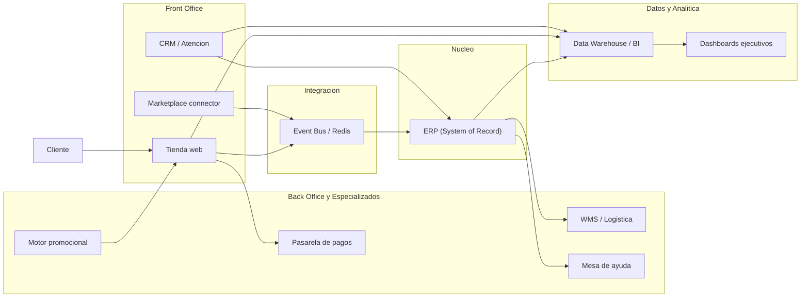

# Brief Ejecutivo-Tecnico

## Datos del caso

- Organizacion elegida: `e-commerce omnicanal`
- Demo practica: `docker compose up --build`

## Resumen ejecutivo

Este brief adapta el mapa de arquitectura del curso a un `e-commerce omnicanal` donde el `ERP` actua como `System of Record` para pedidos, inventario, facturacion y conciliacion operativa. Los sistemas de `Front Office` capturan la demanda del cliente, mientras que sistemas especializados y de `Back Office` ejecutan fulfillment, pagos, atencion y analitica.

Para minimizar acoplamiento y mejorar escalabilidad, el flujo critico de creacion de pedidos se propone con integracion `event-driven`: el front office publica `order_created` y el ERP consume el evento para registrar la orden y disparar procesos posteriores. La demo en Docker implementa precisamente ese flujo.

## A1) Arquitectura aplicada al caso

### Adaptacion del mapa del curso

- `System of Record (nucleo)`: `ERP`
- `Sistemas satelite de Front Office`: tienda web, CRM, marketplace connector
- `Sistemas satelite de Back Office`: WMS/logistica, pasarela de pagos, mesa de ayuda
- `Especializados`: motor promocional y analitica digital
- `Flujo hacia BI`: eventos de ventas, datos maestros del ERP, atencion y analitica web hacia DWH/BI

### Criterio arquitectonico

El `ERP` conserva la fuente oficial para pedido, inventario comprometido, documento comercial y estado operativo. El front office no reemplaza esa verdad; solo captura la interaccion del cliente y publica eventos. Esto reduce integraciones punto a punto y hace mas sencillo agregar nuevos canales sin reescribir el nucleo.

### Diagrama Mermaid obligatorio (flowchart)

### Integracion demostrada en la mini demo

- `storefront-service` representa el `Front Office`
- `erp-service` representa el `System of Record`
- `redis` representa el canal de eventos
- Evento demostrado: `order_created`

### Diagrama complementario del flujo demo

[architecture.md](/Users/adriar/Downloads/Brief%20Ejecutivo/docs/diagrams/architecture.md) y [event-flow.md](/Users/adriar/Downloads/Brief%20Ejecutivo/docs/diagrams/event-flow.md).

## A2) Gobierno de TI (COBIT - minimo viable)

Nota metodologica: la estructura siguiente es una `adaptacion inferida` a partir del enfoque oficial de COBIT para gobierno y gestion; no es una reproduccion literal del marco, cuyos materiales detallados son de ISACA.

### Roles y responsabilidades

| Rol | Responsabilidad principal |
|---|---|
| Direccion / Gerencia General | Define apetito de riesgo, aprueba prioridades y presupuesto TI |
| Lider de TI | Traduce estrategia a arquitectura, integraciones y entrega tecnologica |
| Seguridad de la informacion | Define controles, accesos, monitoreo e incident response |
| Dueno de proceso comercial | Define reglas de pedido, devolucion, SLA y KPIs de negocio |
| Finanzas / Compliance | Valida conciliacion, evidencia, retencion y proveedores |
| Operaciones / Logistica | Asegura inventario, despacho y continuidad operacional |

### 6 decisiones que deben estar gobernadas

1. Cual sistema es la fuente de verdad del cliente, producto, inventario y pedido.
2. Que cambios pueden entrar a produccion, bajo que criterios y con que evidencia.
3. Quien obtiene acceso a que sistema, con que rol y por cuanto tiempo.
4. Como se hacen backups, cuanto se retiene y con que frecuencia se prueba la restauracion.
5. Que proveedores o SaaS pueden integrarse y bajo que evaluacion de riesgo.
6. Como se exponen, versionan y monitorean las integraciones entre sistemas.

### 5 politicas minimas

| Politica | Minimo viable propuesto |
|---|---|
| Accesos e identidades | MFA para accesos administrativos, RBAC por funcion, baja de accesos en maximo 24 horas tras salida |
| Cambios y despliegues | Todo cambio debe tener ticket, responsable, evidencia de prueba y ventana aprobada |
| Backups y restauracion | Backup diario de configuracion y datos criticos; prueba de restauracion al menos trimestral |
| Gestion de incidentes | Clasificacion por severidad, canal unico de escalamiento y postmortem breve para incidentes altos |
| Gestion de proveedores/SaaS | Evaluacion de seguridad, contrato, SLA, tratamiento de datos y plan de salida |

### Mecanismo de gobierno recomendado

- Comite mensual de TI y negocio para decisiones estrategicas.
- Revision semanal de cambios, incidentes y capacidad.
- Matriz simple `decisor / ejecutor / consultado / informado` para cambios criticos.

## A3) Riesgo y seguridad (NIST CSF 2.0)

Nota de fecha: para `1 de marzo de 2026`, el marco vigente es `NIST CSF 2.0`, que organiza el programa en las funciones `Govern, Identify, Protect, Detect, Respond y Recover`.

### Perfil Actual vs Perfil Objetivo

| Funcion | Perfil actual | Perfil objetivo |
|---|---|---|
| Govern | Responsabilidades difusas y controles reactivos | Roles definidos, apetito de riesgo, politicas minimas y revision periodica |
| Identify | Inventario parcial de aplicaciones e integraciones | Inventario completo de activos, flujos, datos y dependencias criticas |
| Protect | Controles basicos de contrasena y red | MFA, RBAC, secretos gestionados y hardening de servicios |
| Detect | Logs dispersos y sin correlacion | Monitoreo centralizado de eventos, alertas y trazabilidad de integraciones |
| Respond | Escalamiento informal | Runbook de contencion, responsables claros y evidencia preservada |
| Recover | Recuperacion dependiente de personas | Backups probados, objetivos RTO/RPO y restauracion ejercitada |

### 6 controles priorizados con justificacion

| Control | Justificacion de impacto | Viabilidad |
|---|---|---|
| MFA para cuentas administrativas | Reduce compromiso de accesos privilegiados | Alta: depende mas de configuracion que de gran inversion |
| RBAC y minimo privilegio | Limita movimientos laterales y errores operativos | Alta: se puede aplicar por roles y grupos |
| Inventario de activos e integraciones | Permite saber que proteger y que recuperar | Alta: puede iniciarse con CMDB simple o catalogo vivo |
| Gestion segura de secretos | Evita credenciales hardcodeadas y filtraciones | Media-Alta: requiere estandarizar despliegues |
| Logging centralizado y alertas | Mejora deteccion temprana y evidencia forense | Media: necesita disciplina operativa y herramientas |
| Backups con prueba de restauracion | Disminuye impacto de ransomware, error humano o corrupcion | Alta: control critico y medible |

### Mini plan de respuesta a incidentes (3 pasos)

1. `Detectar y clasificar`
   Registrar el incidente, confirmar alcance, severidad e impacto en pedido, inventario y datos; alinear con `Detect` y `Govern`.
2. `Contener y responder`
   Aislar el servicio afectado, revocar accesos comprometidos, activar comunicacion interna y preservar evidencia; alinear con `Respond`.
3. `Recuperar y aprender`
   Restaurar servicio o datos, validar integridad operativa, ejecutar postmortem y actualizar controles; alinear con `Recover` y mejora continua.

### Nota sobre la referencia de incidentes

El curso pide referencia NIST IR. Para evitar usar material desactualizado, esta entrega toma como referencia actual `NIST SP 800-61 Rev. 3`, publicado el `8 de abril de 2025`, que reemplaza la revision anterior.

## A4) Metricas (DORA + operacion)

Nota de fecha: para `1 de marzo de 2026`, el sitio oficial de DORA describe `cinco` metricas de entrega. Para cumplir exactamente con la rubrica del curso, aqui se usan `dos metricas DORA` y `dos metricas operativas/seguridad`.

### Metricas definidas

| Metrica | Tipo | Definicion | Por que importa | Como la mediria |
|---|---|---|---|---|
| Deployment Frequency | DORA | Frecuencia con la que se despliegan cambios a produccion | Refleja capacidad de entrega y bajo acoplamiento | Conteo de despliegues productivos por semana o por mes |
| Lead Time for Changes | DORA | Tiempo desde commit aprobado hasta despliegue productivo | Mide friccion del flujo de entrega | Diferencia entre timestamp de merge y timestamp de release |
| MTTR | Operacion | Tiempo medio para restaurar un servicio tras incidente | Mide resiliencia operacional | Promedio entre inicio del incidente y recuperacion confirmada |
| Tasa de restauraciones exitosas de backup | Seguridad/continuidad | Porcentaje de pruebas de restauracion completadas con exito | Verifica que el backup sirve realmente | Restauraciones de prueba exitosas / restauraciones planificadas |

### Aplicacion de metricas al caso

- Si `Deployment Frequency` sube sin aumento de incidentes, la empresa gana capacidad de cambio.
- Si `Lead Time for Changes` baja, nuevas promociones, correcciones o integraciones llegan antes al negocio.
- Si `MTTR` baja, la tienda pierde menos ventas ante fallas.
- Si la `tasa de restauracion exitosa` es alta, la continuidad deja de depender de supuestos.

## Justificacion de la demo frente al brief

La demo no busca ser un ERP real ni una plataforma de comercio completa. Su objetivo es demostrar, en ejecucion real, el principio de arquitectura propuesto:

- el front office captura una orden;
- publica un evento `order_created`;
- el ERP consume el evento y lo registra;
- la evidencia se observa por logs y por una consulta HTTP.

Esto valida el entendimiento del patron `event-driven`, sus ventajas y sus limites.

### Ventajas observables del enfoque event-driven

- Menor acoplamiento entre canal digital y ERP.
- Posibilidad de agregar nuevos consumidores sin cambiar el productor.
- Mejor tolerancia a crecimiento de canales y picos de demanda.

### Desventajas o riesgos a explicar en el video

- Mayor complejidad operativa que un punto a punto simple.
- Necesidad de trazabilidad, observabilidad y manejo de reintentos.
- Riesgo de duplicados o consistencia eventual si no se gobierna bien.

## Referencias oficiales

- ISACA COBIT: <https://www.isaca.org/resources/cobit>
- NIST Cybersecurity Framework 2.0: <https://www.nist.gov/cyberframework>
- NIST CSF 2.0 PDF: <https://nvlpubs.nist.gov/nistpubs/CSWP/NIST.CSWP.29.pdf>
- NIST SP 800-61 Rev. 3: <https://csrc.nist.gov/pubs/sp/800/61/r3/final>
- DORA metrics: <https://dora.dev/guides/dora-metrics-four-keys/>
- Google Cloud Four Keys: <https://cloud.google.com/blog/products/devops-sre/using-the-four-keys-to-measure-your-devops-performance>
- Mermaid: <https://mermaid.js.org/>
- GitHub Mermaid rendering: <https://docs.github.com/en/get-started/writing-on-github/working-with-advanced-formatting/creating-diagrams>
