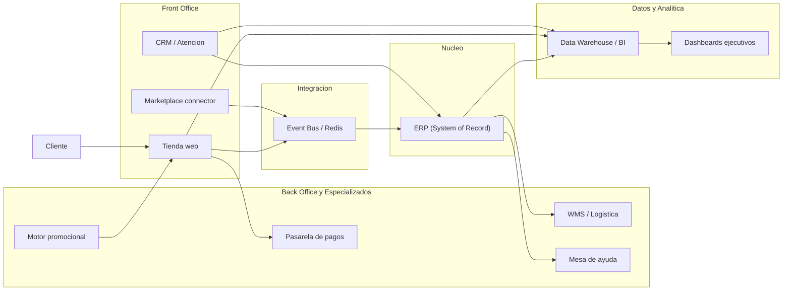

# Diagrama de Arquitectura

```mermaid
flowchart LR
    subgraph FO["Front Office"]
        WEB["Tienda web"]
        CRM["CRM / Atencion"]
        MKT["Marketplace connector"]
    end

    subgraph INTEG["Integracion"]
        BUS["Event Bus / Redis"]
    end

    subgraph CORE["Nucleo"]
        ERP["ERP (System of Record)"]
    end

    subgraph BO["Back Office y Especializados"]
        WMS["WMS / Logistica"]
        PAY["Pasarela de pagos"]
        HELP["Mesa de ayuda"]
        PROMO["Motor promocional"]
    end

    subgraph BI["Datos y Analitica"]
        DWH["Data Warehouse / BI"]
        DASH["Dashboards ejecutivos"]
    end

    CLIENTE["Cliente"] --> WEB
    WEB --> PAY
    WEB --> BUS
    MKT --> BUS
    BUS --> ERP
    ERP --> WMS
    ERP --> HELP
    CRM --> ERP
    PROMO --> WEB
    ERP --> DWH
    WEB --> DWH
    CRM --> DWH
    DWH --> DASH
```
