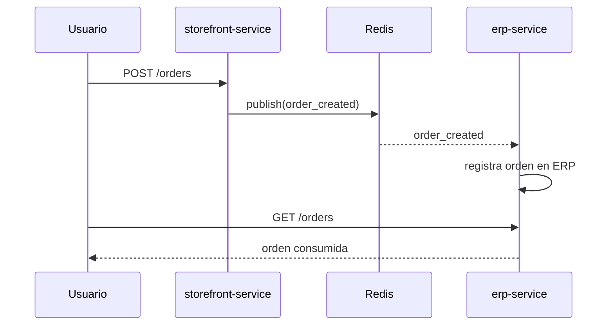

# Flujo Event-Driven de la Demo

```mermaid
sequenceDiagram
    participant U as Usuario
    participant S as storefront-service
    participant R as Redis
    participant E as erp-service

    U->>S: POST /orders
    S->>R: publish(order_created)
    R-->>E: order_created
    E->>E: registra orden en ERP
    U->>E: GET /orders
    E-->>U: orden consumida
```
